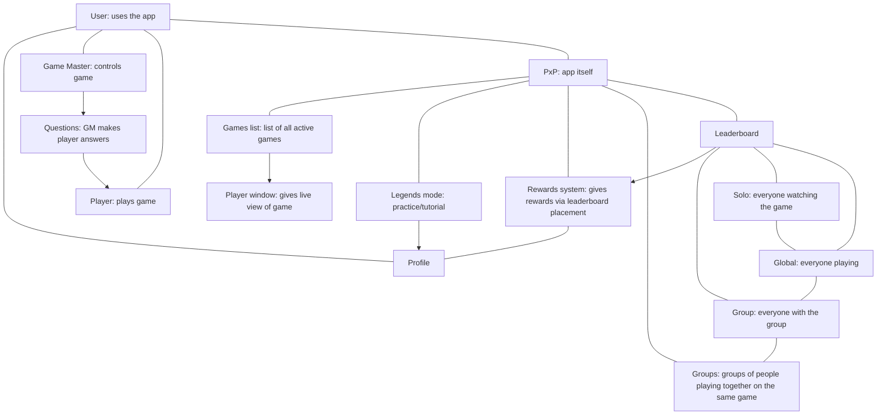

```mermaid
flowchart TD
    User["User: uses the app"] --- Profile["Profile"] & GameMaster["Game Master: controls game"] & Player["Player: plays game"] & PxP["PxP: app itself"]
    PxP --- GamesList["Games list: list of all active games"] & LegendsMode["Legends mode: practice/tutorial"] & Rewards["Rewards system: gives rewards via leaderboard placement"] & Groups["Groups: groups of people playing together on the same game"] & Leaderboard["Leaderboard"]
    Leaderboard --> Rewards
    Leaderboard --- Group["Group: everyone with the group"] & Solo["Solo: everyone watching the game"] & Global["Global: everyone playing"]
    Solo --- Global
    Global --- Group
    Group --- Groups
    GameMaster --> Questions["Questions: GM makes player answers"]
    Questions --> Player
    Rewards --- Profile
    GamesList --> PlayerWindow["Player window: gives live view of game"]
    LegendsMode --> Profile
```
