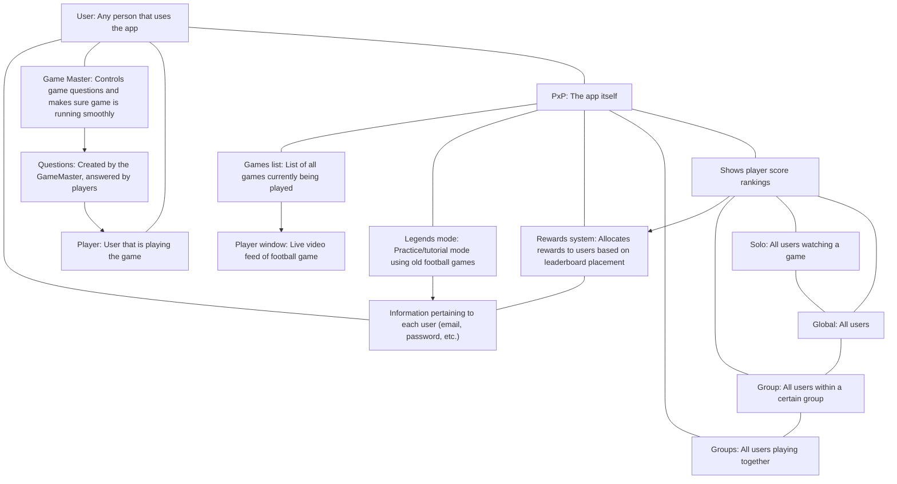

```mermaid
flowchart TD
    User["User: Any person that uses the app"] --- Profile["Information pertaining to each user (email, password, etc.)"] & GameMaster["Game Master: Controls game questions and makes sure game is running smoothly"] & Player["Player: User that is playing the game"] & PxP["PxP: The app itself"]
    PxP --- GamesList["Games list: List of all games currently being played"] & LegendsMode["Legends mode: Practice/tutorial mode using old football games"] & Rewards["Rewards system: Allocates rewards to users based on leaderboard placement"] & Groups["Groups: All users playing together"] & Leaderboard["Shows player score rankings"]
    Leaderboard --> Rewards
    Leaderboard --- Group["Group: All users within a certain group"] & Solo["Solo: All users watching a game"] & Global["Global: All users"]
    Solo --- Global
    Global --- Group
    Group --- Groups
    GameMaster --> Questions["Questions: Created by the GameMaster, answered by players"]
    Questions --> Player
    Rewards --- Profile
    GamesList --> PlayerWindow["Player window: Live video feed of football game"]
    LegendsMode --> Profile
```
